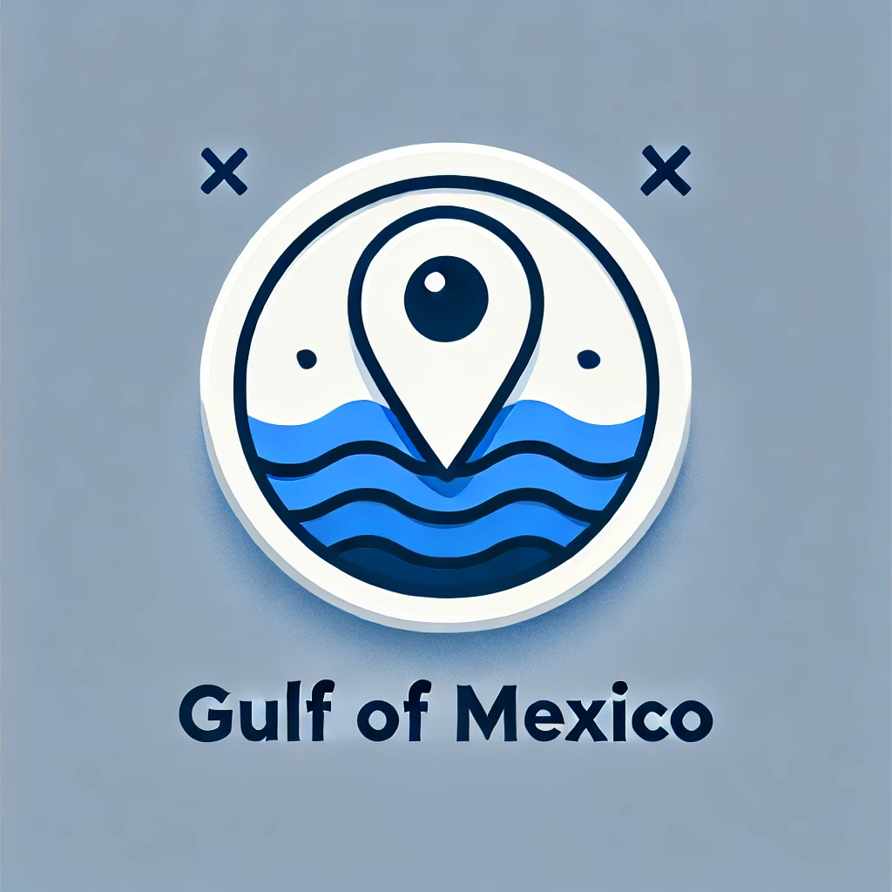

# Gulf Of Mexico – Chrome Extension

## Description

This Chrome extension is tailored specifically for Google Maps. It monitors the map labels in the sidebar and on the map itself for any altered references to the “Gulf of Mexico” (e.g., “Gulf of America”) and immediately restores the historically recognized name in real time. It ensures that when you’re browsing Google Maps, you always see “Gulf of Mexico.”

## Why This Extension Was Made

In January 2025, President Donald Trump signed Executive Order 14172 directing the U.S. Interior Secretary to rename the Gulf of Mexico to the “Gulf of America” in all federal usage—an effort framed as bolstering an “America First” narrative but widely criticized as politicizing geographic names. Shortly afterwards, Google announced it would “bend the knee” to that order by updating its U.S. map labels to show “Gulf of America” on Google Maps, citing its practice of adopting official government name changes. This sparked an international backlash, including a lawsuit by Mexico against Google for labeling the ocean basin—known for over 400 years as the Gulf of Mexico as the “Gulf of America”. This extension was created to highlight and correct such changes on Google Maps, preserving historical accuracy and preventing unilateral renaming from going unnoticed.

## Features

- **Google Maps–Only**: Activates exclusively on `maps.google.com` pages.  
- **Label Correction**: Detects “Gulf of America” (and variants) in map labels and replaces them with “Gulf of Mexico.”  
- **Toggle Control**: Turn auto-correction on or off from the extension popup.  

## Installation

1. Clone the repository:  
   ```bash
   git clone https://github.com/robertsbaer/Gulf-Of-Mexico